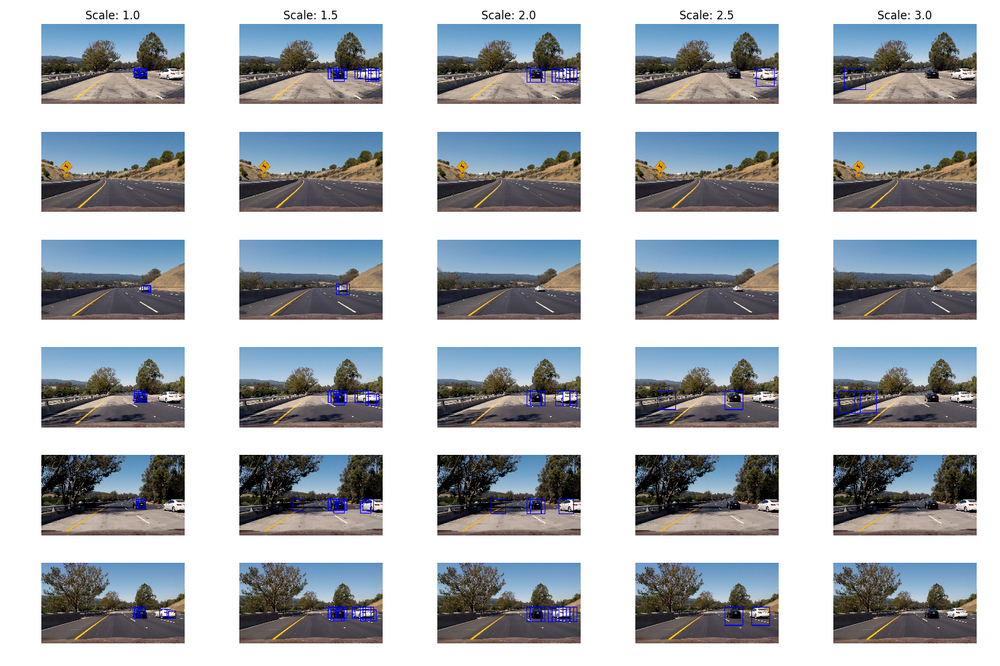

# Vehicle Detection Pipeline

This project contains two Python notebooks, which together implement a pipeline
for detecting vehicles in video frames.
* The [classifier notebook](Car classifier.ipynb) trains an SVM classifier,
which can classify 64x64 pixel images as either vehicle or non-vehicle;
* The [pipeline notebook](Vehicle detection.ipynb) uses the classifier to
detect vehicles in video frames, saving an annotated video as output;
* A separate [python file](features.py) contains shared code for the two
notebooks.

## Vehicle classifier

The classifier has been trained on approximately 9000 each of vehicle and
non-vehicle images.  The following functions in [features.py](features.py)
are used for creating a feature vector from each image, which can then be
passed to the classifier:
* `bin_spatial` - resizes the image and returns a vector of binned colour
levels;
* `color_hist` - returns a vector of colour histograms for each of the colour
channels in the image;
* `get_hog_features` -  calls the `hog` function from
[skimage](http://scikit-image.org/docs/dev/api/skimage.feature.html?highlight=hog#skimage.feature.hog)
to get a histogram of oriented gradients; and
* `extract_features` brings everything together by:
  * transforming the colour space of the input image;
  * calling the three functions above to get different features; and
  * concatenating the results into a single consolidated feature vector.

To choose appropriate parameters I reserved 20% of the labelled images as a
test set on which to evaluate the performance of the trained classifier, and
then trained it with different parameter values. For instance, by changing the
`orientations` parameter, the classifier performed as follows:

| orientations | training accuracy | test accuracy |
|--------------|-------------------|---------------|
| 6            | 100%              | 98.6%         |
| 9            | 100%              | 98.8%         |
| 12           | 100%              | 98.9%         |

In this case I chose `orientations = 9` to achieve a balance between
classifier accuracy while also favouring smaller feature vectors in order to
reduce the compute time required for the classification.  Interestingly the
HSV colour space resulted in the best test accuracy, but later on I found that
using YCrCb space improved the performance on the video by reducing the number
of false-positive detections.

Using an SVM classifier also requires the input features to be appropriately
scaled.  This takes place in the [classifier notebook](Car classifier.ipynb)
by calling `StandardScaler` from
[sklearn](http://scikit-learn.org/stable/modules/generated/sklearn.preprocessing.StandardScaler.html)
on the training features.

The classifier is trained in the notebook by calling `svm.fit` against the
scaled features.  The image below shows a sample of the test images that have
been labelled by the classifier.

Finally the notebook saves the scaler, classifier and parameters to a pickle
file for use on the video-processing pipeline.

## Video-processing pipeline

The [pipeline notebook](Vehicle detection.ipynb) loads the classifier trained
previously, and calls the `find_cars` function from within
[features.py](features.py) to search for vehicles within a video frame image.
Specifically this works by:
* Restricting the search area to the lower part of the image, since there is no
point trying to detect vehicles in the sky;
* Applying the same colour transformation used for training the classifier, and
also re-scaling the image to allow vehicles at different sizes to be detected;
* Defining a 64x64 pixel window to slide (and overlap) across the image and
extract features for the classifier;
* Re-scaling the features and feeding them to `svc.predict` to decide whether
a particular window contains a vehicle; and
* Returning a list of bounding boxes wherever the classifier predicts a vehicle.

To optimise computational performance the hog feature extraction is done first
before the sliding window is applied and the other features generated.

The figure below shows where vehicles have been detected in sample images by
calling `find_cars` with different scales.

For the final pipeline I chose to use scales of 1.0, 1.5, and 2.0 and
and superimpose the overlapping bounding box detections into a heatmap.  
The figure below shows a heatmap for each test image, showing how this procedure
identifies the vehicles as a 'hot' region in each case.

Finally, I applied averaging of the heatmap across multiple video frames to
reduce the level of false-positive detections.  For a vehicle to be detected it
must be present in a similar region across 20 consecutive frames.  This is
implemented in the `CarDetector` class, which stores a heatmap after each video
frame is fed in, applies a threshold to identify the final boxes around each
vehicle and then annotates the image frames.

## Video output

The video result is [here](output_images/project_video.mp4).  The pipeline
detects each vehicle, identifying it with a blue box, with no false-positives.

## Improvements

The pipeline implemented here works well at identifying regions where a vehicle
is present, but cannot separate two vehicles that are next to or behind each
other.  Potentially this could be improved by using multiple cameras with
different angles, or combining the video detection with radar data.

Another problem is that it runs considerably slower than real-time.  This might
be improved by exploring approaches to parallel and/or GPU processing, or
reducing the search area in each image, i.e. only searching in the neighbourhood
of a previously detected vehicle or at the edges of the image.

Finally, the pipeline is likely to fail where vehicles look different from
the training data, e.g. a large lorry at an unusual angle, or where lighting
conditions are poor.  This could be addressed with a more sophisticated
classifier, trained against a more varied set of images.
